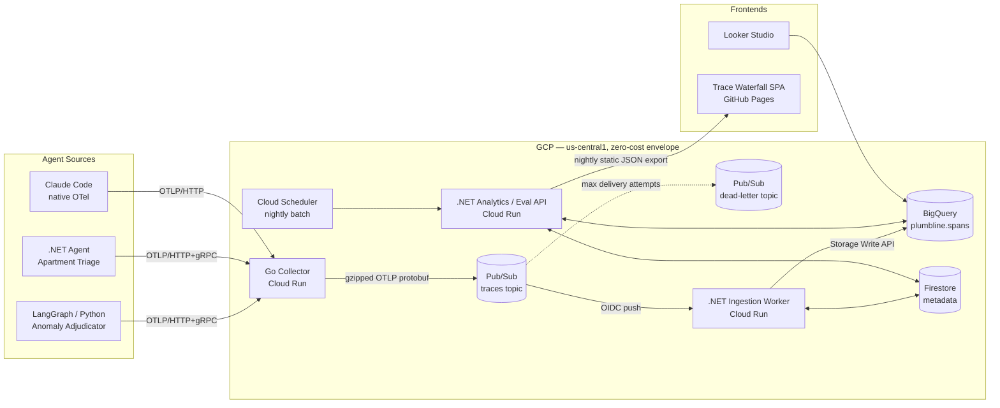

# plumbline — Architecture

**Version:** 0.2 · **Status:** Draft for F0 sign-off · **Date:** 2026-08-18
**Semantic conventions:** OTel GenAI semconv pinned at **v1.41** (see §5)
**Scope:** Current-state architecture, component contracts, data flow, data model, and
enforcement points for cost/security invariants. Decision *rationale* lives in ADRs (§10);
this document states the decisions and their operational consequences.

---

## 1. System Overview

External LLM judges (Google AI Studio Flash tier, local Ollama) are invoked by the Eval
engine inside the Analytics/Eval API and are covered in `docs/eval-plan.md`, not here.

---

## 2. Component Responsibilities

Each component has an explicit contract: what it owns, and what it must **not** do.
Boundary violations are treated as design regressions.

### 2.1 Go Collector (data plane)
- **Owns:** OTLP receive (HTTP `4318` + gRPC `4317`), API-key authentication, per-key
  rate limiting, batching, gzip compression, publish to Pub/Sub.
- **Contract in:** standard OTLP `ExportTraceServiceRequest` from any OTel SDK.
- **Contract out:** Pub/Sub message per §3.2. Raw protobuf bytes are never mutated
  (ADR-0001, wire-only — see §3.1).
- **Must not:** parse span semantics, normalize attributes, or apply dialect logic.
  The collector is dialect-agnostic by design; it may attach a `source_dialect` *hint*
  derived from the API key's registration, nothing more.
- **State:** stateless except in-memory rate-limit buckets (see §6.2 limitation).

### 2.2 Pub/Sub (transport)
- **Owns:** decoupling data plane from control plane; backpressure absorption;
  dead-lettering of poison messages.
- **Topology:** one topic `traces`, one OIDC push subscription to the worker, one
  dead-letter topic `traces-dlq` with a pull subscription.
- **Must not:** hold data as a store. Topic-level message retention is **disabled on all
  topics** (paid feature). The DLQ relies solely on subscription-level unacked message
  retention (default 7 days, free). These are two different mechanisms; Terraform must
  not generalize one onto the other.

### 2.3 .NET Ingestion Worker (control plane, write path)
- **Owns:** OIDC push endpoint; gunzip + OTLP protobuf deserialization; dialect
  detection; v1.41 normalization via the embedded mapping table (§5); writes to BigQuery
  via **Storage Write API** (default stream).
- **Contract in:** Pub/Sub push envelope per §3.2.
- **Contract out:** rows in `spans` per §4.1.
- **Must not:** use `insertAll` (hard-forbidden, cost invariant); drop unmapped
  attributes (they are preserved in `attributes` JSON); silently swallow poison messages
  (NACK → retry → DLQ, per §3.4).

### 2.4 BigQuery (analytical store)
- **Owns:** span storage and all analytical queries.
- **Constraints:** date-partitioned, `trace_id`-clustered, `require_partition_filter=true`
  on every table; project-level custom query quota. Details in §4.1.

### 2.5 .NET Analytics / Eval API (control plane, read path)
- **Owns:** query endpoints over BigQuery; eval engine (deterministic rules + tiered
  LLM judge); regression gate; nightly batch entrypoint (Cloud Scheduler); nightly
  static JSON export for the SPA.
- **Must not:** expose a public unauthenticated live API in v0.1 (see §3.5).

### 2.6 Firestore (metadata store)
- **Owns:** API key registry (hashed), eval definitions, frozen dataset references,
  eval run states.
- **Must not:** hold normalization mapping tables (rejected: config-as-hidden-state
  drift risk; mappings are versioned in-repo, §5) or span data.

### 2.7 Frontends
- **Looker Studio:** reads BigQuery directly (partition-filtered views only).
- **Trace Waterfall SPA:** static site on GitHub Pages; consumes nightly static JSON
  export. No live backend dependency in v0.1. Pages on GitHub Free requires a **public**
  repository (F0 spec §0.2); a private repository would make this data path a paid
  feature and break the zero-cost invariant.

---

## 3. Data Flow & Message Contracts

### 3.1 OTLP preservation — scope of ADR-0001 (wire-only)
"OTLP preserved end-to-end" is defined as **wire-level** preservation: from agent SDK
through collector to worker deserialization, the `ExportTraceServiceRequest` protobuf
bytes are never re-modeled into an invented canonical schema.

The **at-rest representation** in BigQuery is *not* raw bytes. It is a set of normalized
columns faithful to OTLP field names plus a lossless `attributes` JSON column. A raw
protobuf bytes column is deliberately **not** stored (would erode the 10 GB storage free
tier for zero analytical value). Fidelity of raw → normalized mapping is guaranteed by
golden-file tests per dialect (F1 DoD), not by storing the wire format.

Any future proposal to persist raw bytes is a scope change and requires an ADR.

### 3.2 Pub/Sub message contract
- **Payload:** exactly **one** gzipped, binary OTLP `ExportTraceServiceRequest` per
  message. No JSON encoding, no re-batching across export requests.
- **Attributes:**
  | Attribute | Source | Purpose |
  |---|---|---|
  | `api_key_id` | Collector auth | Provenance; joins to Firestore key registry |
  | `source_dialect` | API key registration | *Hint only*; worker detection is authoritative |
  | `content_encoding` | Collector | Always `gzip` in v0.1; explicit for forward compat |
  | `schema_url` | OTLP resource | Semconv version audit trail |
- **Size budget:** collector enforces batch sizing so the compressed payload stays well
  under the 10 MB push limit; working target ≤ 4 MiB compressed. Oversized batches are
  split at the collector, never truncated.

### 3.3 Delivery semantics
- **At-least-once.** Exactly-once subscriptions are not used (complexity + regional
  constraints, no zero-cost benefit).
- **Dedup is downstream:** duplicates land in BigQuery and are eliminated at query time
  and gate time on `(trace_id, span_id)`. Canonical views (§4.1) encapsulate the dedup
  so dashboards and the eval engine never see duplicates.
- **Write path:** Storage Write API **default stream** (at-least-once, matches the
  above; no exactly-once committed-stream complexity in v0.1).

### 3.4 Dead-letter path
- Main subscription: max delivery attempts = 5, then routed to `traces-dlq`.
- DLQ has a **pull** subscription (no consumer by default) + an alert on
  `num_undelivered_messages > 0`.
- Rationale: a poison message disappearing silently violates *no silent degradation*.
  Cost of the DLQ path is ~0 (no topic retention; subscription retention is free).
- Replay is manual in v0.1 (documented runbook step, not automation).

### 3.5 SPA data path (v0.1)
Nightly job in the Analytics/Eval API exports curated JSON (recent traces, eval
summaries, `synthetic` flagged separately) committed/pushed to the GitHub Pages branch.
Zero cost, zero attack surface, no cold-start dependency for the public demo.
A live read-only API (CORS + rate limit) is a separate F4 decision, not assumed here.

This path assumes a public repository (F0 spec §0.2). The exported JSON is therefore
world-readable by construction: it carries curated trace and eval summaries only, and
never API keys, customer data, or internal hostnames.

---

## 4. Data Model

### 4.1 BigQuery

**Dataset:** `plumbline` (us-central1).

**Table `spans`** (written only via Storage Write API):

| Column | Type | Notes |
|---|---|---|
| `start_time` | TIMESTAMP | **Partition column** (daily granularity) |
| `end_time` | TIMESTAMP | |
| `trace_id` | STRING | **Clustering key #1** |
| `span_id` | STRING | Clustering key #2 |
| `parent_span_id` | STRING | Nullable |
| `name` | STRING | |
| `kind` | STRING | OTLP enum name |
| `status_code`, `status_message` | STRING | |
| `service_name` | STRING | From resource attributes |
| `source_dialect` | STRING | Worker-detected (authoritative), see §5 |
| `api_key_id` | STRING | Provenance |
| `schema_url` | STRING | Semconv audit |
| `synthetic` | BOOL | From resource attr `synthetic=true`; **walled-off** flag |
| `gen_ai_*` | (typed) | Normalized v1.41 GenAI columns (system, operation, model, token counts, …) — exact list owned by the mapping table (§5) |
| `attributes` | JSON | Lossless remainder: all attributes incl. unmapped/original keys |
| `events`, `links` | JSON | OTLP events/links, unflattened |
| `ingest_time` | TIMESTAMP | Worker write time |

- **Options:** time partitioning on `start_time` (daily); clustering
  `(trace_id, span_id)`; `require_partition_filter = true`.
- **Views:** `spans_deduped` (QUALIFY ROW_NUMBER over `(trace_id, span_id)` keeping
  latest `ingest_time`) and `spans_real` (`synthetic = false`). All consumers (Looker,
  eval engine, SPA export) read views, never the base table.
- **`eval_results` table:** required for dashboarding but its schema is owned by the F3
  eval-engine spec; intentionally not fixed here (see §10 Open Questions).

### 4.2 Firestore collections

| Collection | Contents | Notes |
|---|---|---|
| `api_keys` | key hash, `api_key_id`, registered dialect hint, rate-limit tier, status | Plaintext keys never stored |
| `eval_definitions` | deterministic rules + judge configs, versioned | Frozen per `eval-plan.md` |
| `datasets` | frozen golden dataset references (GCS/BQ pointers + checksums) | Immutable after freeze |
| `eval_runs` | run state machine, thresholds used, verdicts | Gate audit trail |

---

## 5. Normalization Layer

- **Pin:** GenAI semconv **v1.41**. The pin is a contract: emitter drift is mapped *to*
  v1.41, never the reverse.
- **Dialects (v0.1):** `langgraph-python`, `dotnet-agent`, `claude-code`.
- **Detection:** worker-side, deterministic, based on resource/scope attributes
  (instrumentation scope name/version, resource markers). The collector's
  `source_dialect` attribute is a hint used only as a tiebreaker; on mismatch the
  detected value wins and the mismatch is logged.
- **Mapping tables:** versioned YAML under `normalization/mappings/v1.41/<dialect>.yaml`,
  **embedded into the worker binary at build time**. No runtime config store
  (Firestore rejected: hidden-state drift). A mapping change is a code change: PR,
  review, golden-file tests.
- **Unknown dialect:** processed as generic OTLP — normalized columns filled where OTLP
  fields map directly, everything else preserved in `attributes` JSON,
  `source_dialect='unknown'`, counter metric incremented. Never dropped.
- **Golden-file tests:** per dialect, raw `ExportTraceServiceRequest` fixture →
  expected normalized rows. These tests are the enforcement mechanism of §3.1.

---

## 6. Security Model

### 6.1 Identity & auth boundaries
| Boundary | Mechanism |
|---|---|
| Agent → Collector | API key (header), validated against hashed registry in Firestore; per-key rate limit |
| Collector → Pub/Sub | Collector service account, `roles/pubsub.publisher` on `traces` only |
| Pub/Sub → Worker | **OIDC push**: push SA is sole `roles/run.invoker` on the worker; worker ingress `internal-and-cloud-load-balancing` equivalent for Cloud Run (`ingress=all` avoided; unauthenticated invocations disabled) |
| Worker → BigQuery/Firestore | Dedicated SA, table/collection-scoped least privilege |
| GitHub Actions → GCP | **Workload Identity Federation**; no exported SA keys anywhere in the project |
| Analytics API → public | Not exposed in v0.1 (static export path, §3.5) |

### 6.2 Known limitation — rate limiting
Per-key rate limiting is an in-memory token bucket per collector instance. With
`max-instances ≤ 2`, the effective limit is approximate (up to 2× nominal). Accepted:
a shared limiter (Redis/Memorystore) violates the zero-cost invariant. Documented,
not hidden.

### 6.3 Secrets
API keys are generated once, shown once, stored hashed. No secrets in env-committed
files; runtime secrets via Cloud Run env from Terraform-managed Secret Manager only if
free-tier limits allow — otherwise hashed-registry design keeps the collector
secret-free by construction.

---

## 7. Cost Guardrails — invariant → enforcement point

| Invariant | Enforcement point(s) |
|---|---|
| Storage Write API only; the legacy streaming insert API and its client package are forbidden | **Gate A (load-bearing):** no `Google.Cloud.BigQuery.V2` reference in any `*.csproj` or `Directory.Packages.props` — if the package is absent the forbidden API surface cannot be reached, whatever the symbol is called. **Gate B (secondary):** path-scoped symbol scan over `collector/**/*.go`, `worker/**/*.cs`, `analytics/**/*.cs` for `insertAll`, `tabledata.insertAll`, `InsertRow(`, `InsertRows(`, `InsertRowsAsync(`, `.Inserter(`. Code review is **not** an enforcement point |
| `require_partition_filter=true`, custom query quota | Terraform (`google_bigquery_table`, project quota) |
| Cloud Run `min=0`, `max≤2`, smallest instance, us-central1 | Terraform; CI check on plan diff |
| Pub/Sub: no topic retention; batched+gzipped | Terraform (topics); collector code + golden tests (batching) |
| LLM: free-tier Gemini + client-side limiter; bulk on Ollama | Eval engine code; quota config in `eval_definitions` |
| Billing kill-switch | Budget alert → Pub/Sub → billing-detach function; **fire-tested in F0 (DoD)** |
| Artifact Registry < 0.5 GB | Distroless images; cleanup policy keep-last-2 (Terraform) |
| No Cloud SQL / custom domain / paid SaaS | Architecture review; Terraform allowlist of resource types |
| Public repository (Pages + unmetered Actions on Free) | F0 spec §0.2; `main` branch protection; Gate C (no exported SA keys) and Gate D (no `pull_request_target`) |

Escape hatch: any spend > $0.00 for two consecutive days triggers an incident note in
`docs/` — before the kill-switch makes the question moot.

---

## 8. Deployment Topology

- **Region:** `us-central1` (all services, dataset, topics).
- **Cloud Run services:** `collector` (Go), `ingestion-worker` (.NET), `analytics-api`
  (.NET). All: `min-instances=0`, `max-instances=2`, smallest viable CPU/mem,
  concurrency tuned per service in F2.
- **Images:** distroless, built in GitHub Actions, pushed to Artifact Registry via WIF,
  deployed by Terraform-driven pipeline. Cleanup policy: keep last 2 tags.
- **Terraform ownership:** all GCP resources (Pub/Sub, BQ, Firestore, Cloud Run,
  Scheduler, budget/kill-switch, quotas, IAM). Nothing hand-created; drift = bug.
- **Local-first:** full pipeline runs under docker-compose (F1) with emulators/local
  stand-ins; GCP is a deployment target, not a development dependency.

---

## 9. Non-goals (v0.1)

- Competing feature-for-feature with mature observability vendors.
- Metrics/logs pipelines (traces only; OTLP metrics/logs out of scope).
- Multi-region, autoscaling beyond 2 instances, or any paid-tier capacity.
- Exactly-once delivery semantics.
- Live public API for the SPA (static export instead; revisit in F4).
- Runtime-configurable normalization (mappings are code).
- Storing raw OTLP bytes at rest.

---

## 10. ADR Index & Open Questions

### ADR index
| ADR | Title | Status |
|---|---|---|
| ADR-0001 | Preserve OTLP wire format end-to-end; no invented canonical schema (wire-only scope per §3.1) | Accepted |
| ADR-0002 | Pub/Sub message contract & at-least-once delivery with downstream dedup | Proposed (this doc §3.2–3.3) |
| ADR-0003 | Normalization mappings as versioned in-repo YAML embedded at build time | Proposed (this doc §5) |
| ADR-0004 | Zero-cost guardrails & billing kill-switch design | Proposed (this doc §7) |
| ADR-0005 | Static JSON export as v0.1 SPA data path | Proposed (this doc §3.5) |

Titles for 0002–0005 mirror decisions fixed in this document; each still needs its
rationale/alternatives write-up before F0 exit.

### Open questions
1. `eval_results` BigQuery schema — owned by F3 eval-engine spec.
2. Secret Manager vs. secret-free collector (hashed registry only) — confirm in F2
   against free-tier limits.
3. SPA export cadence & payload size budget for GitHub Pages — confirm in F4.
4. Claude Code emitter: confirm actual resource/scope markers for dialect detection
   against a captured sample before freezing its mapping YAML (F1).

---

## 11. Changelog

**v0.2 — 2026-08-18** — imported into the repository (F0 spec W1.1). Three changes
applied at import time; the ADR index (§10) and the open questions carry over from
v0.1 unchanged.

1. **BigQuery dataset renamed** to `plumbline` per F0 spec §0.1: §4.1 dataset line and
   the §1 diagram, where the BigQuery node is now qualified as `plumbline.spans`. The
   pre-decision working name appears nowhere in the repository.
2. **§7 BigQuery write-path guardrail row rewritten.** v0.1 named "Code review + CI grep
   gate" as the enforcement point. That control cannot detect the violation it targets:
   the .NET client exposes the streaming insert path as
   `BigQueryClient.InsertRow`/`InsertRows`/`InsertRowsAsync` and never surfaces the
   literal REST method name, so a real violation in `worker/` would pass the grep. The
   row now names Gate A (forbidden `Google.Cloud.BigQuery.V2` dependency, load-bearing)
   and Gate B (path-scoped symbol scan), per F0 spec §W6.2. Code review is explicitly
   demoted from enforcement point to review practice.
3. **Repository visibility and license recorded** where this document assumed them:
   §2.7 and §3.5 now state that the GitHub Pages data path requires a public repository
   under GitHub Free, and §7 carries a public-repository row. The project is licensed
   Apache-2.0 (F0 spec §0.3).

**v0.1 — 2026-08-18** — initial draft for F0 sign-off (external snapshot, never in the
repository).
